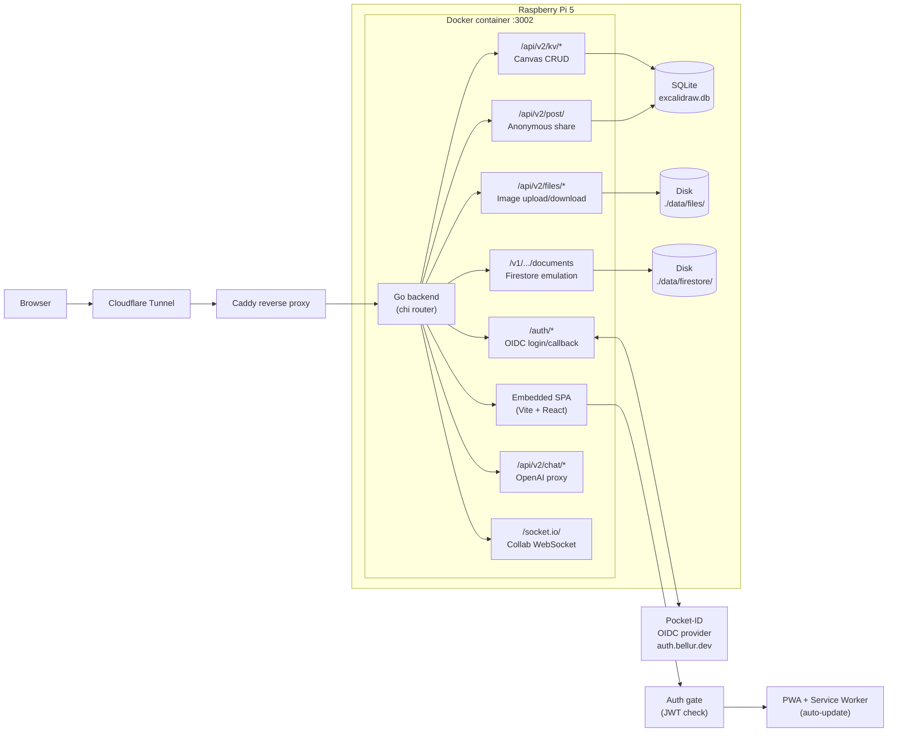

# Excalidraw — Pi Self-Hosted

A fork of [BetterAndBetterII/excalidraw-full](https://github.com/BetterAndBetterII/excalidraw-full) configured for Raspberry Pi self-hosting with OIDC auth, JWT-protected canvases, and collab image support.

## What's Different from Upstream

- **Frontend auth gate**: only OIDC-authenticated users can access the app
- **Local file storage backend** for collab images (replaces broken Firebase Storage calls)
- **Firestore emulation persisted to disk** (collab canvas state survives container restarts)
- **Frontend patches in `excalidraw-patches/`** overlaid during Docker build (no need to fork the submodule)
- **Dockerfile tuned** for Pi 4GB RAM Vite builds (`NODE_OPTIONS=--max-old-space-size=3072`)
- **Local docker-compose build** instead of pulling from GHCR
- cloudflare-worker submodule removed (not used for Pi deployment)

## Architecture



## Prerequisites

- Raspberry Pi 5 (4GB+ RAM) or any ARM64/AMD64 Linux host
- Docker + docker-compose
- A Pocket-ID instance (or any OIDC provider) reachable at a public URL
- A reverse proxy that terminates TLS in front of the container (Caddy, Traefik, etc.)
- Persistent volume mounted at the path in `LOCAL_STORAGE_PATH`

## Setup

1. Clone this repo (with submodule):
   ```bash
   git clone --recursive https://github.com/sametbellur/excalidraw-pi.git && cd excalidraw-pi
   ```

2. Copy `.env.example` to `.env` and fill in values:
   ```bash
   cp .env.example .env
   nano .env
   ```

3. Create the SQLite database file:
   ```bash
   touch excalidraw.db
   ```

4. Configure your OIDC provider with these settings:
   - **Callback URL**: `https://your-domain.example.com/auth/callback`
   - **Logout URL**: `https://your-domain.example.com`
   - **PKCE**: disabled (frontend doesn't send code_challenge)

5. Build and start:
   ```bash
   docker compose build   # ~5-25 min on Pi 5 depending on RAM contention
   docker compose up -d
   ```

## Environment Variables

| Variable | Required | Description |
|---|---|---|
| `OIDC_ISSUER_URL` | Yes | OIDC provider URL (e.g. `https://auth.bellur.dev`) |
| `OIDC_CLIENT_ID` | Yes | OIDC client ID |
| `OIDC_CLIENT_SECRET` | Yes | OIDC client secret |
| `OIDC_REDIRECT_URL` | Yes | Must match your OIDC provider callback config |
| `JWT_SECRET` | Yes | Generate with `openssl rand -base64 32` |
| `STORAGE_TYPE` | Yes | `sqlite` recommended |
| `DATA_SOURCE_NAME` | Yes | SQLite DB path, e.g. `excalidraw.db` |
| `LOCAL_STORAGE_PATH` | No | Directory for file + firestore storage (default: `./data`) |
| `EXCALIDRAW_BACKEND_HOST` | No | Override backend host detection (leave empty for auto) |
| `OPENAI_API_KEY` | No | Enables AI chat features |
| `FILE_UPLOAD_MAX_BYTES` | No | Max upload size in bytes (default: 10485760 = 10MB) |

## Endpoints

| Path | Auth | Description |
|---|---|---|
| `/` | Auth gate | SPA entry point (body hidden until JWT validated) |
| `/auth/login` | None | Initiates OIDC flow |
| `/auth/callback` | None | OIDC callback, sets JWT in URL query |
| `/api/v2/kv/` | JWT | Canvas list (also used by auth gate for validation) |
| `/api/v2/kv/{key}` | JWT | Canvas CRUD (GET/PUT/DELETE) |
| `/api/v2/files/{fileId}` | JWT | File upload (POST) / download (GET) for collab images |
| `/api/v2/post/` | None | Anonymous document share (create) |
| `/api/v2/{id}` | None | Anonymous document share (read) |
| `/v1/.../documents:commit` | None | Firestore emulation - collab canvas state write |
| `/v1/.../documents:batchGet` | None | Firestore emulation - collab canvas state read |
| `/api/v2/chat/completions` | JWT | OpenAI proxy (requires OPENAI_API_KEY) |
| `/socket.io/` | None | Real-time collaboration WebSocket |

## Testing Auth Gate

In your browser DevTools console after loading the app:

```js
// Simulate token tampering - should bounce to /auth/login
localStorage.setItem('token', 'fake'); location.reload();
```

## Testing Collab Image Storage

1. **Upload via curl** (replace `$TOKEN` with a valid JWT):
   ```bash
   echo "test data" | curl -X POST http://localhost:3002/api/v2/files/test123 \
     -H "Authorization: Bearer $TOKEN" \
     -H "Content-Type: application/octet-stream" \
     --data-binary @- -w "\n%{http_code}\n"
   # Expected: {"fileId":"test123","size":10} with 200

   curl http://localhost:3002/api/v2/files/test123 \
     -H "Authorization: Bearer $TOKEN" -o /dev/null -w "%{http_code}\n"
   # Expected: 200
   ```

2. **Upload without auth** (should fail):
   ```bash
   echo "test" | curl -X POST http://localhost:3002/api/v2/files/noauth \
     -H "Content-Type: application/octet-stream" \
     --data-binary @- -w "\n%{http_code}\n"
   # Expected: 401
   ```

3. **Path traversal** (should be rejected):
   ```bash
   echo "hack" | curl -X POST "http://localhost:3002/api/v2/files/..%2F..%2Fetc%2Fpasswd" \
     -H "Authorization: Bearer $TOKEN" \
     -H "Content-Type: application/octet-stream" \
     --data-binary @- -w "\n%{http_code}\n"
   # Expected: 400 (invalid file ID)
   ```

4. **Browser collab test**: Open two browser tabs, start a collab session, paste an image in tab A. Tab B should display the image (not a placeholder rectangle).

## Rebuilding After Changes

```bash
docker compose build --no-cache
docker compose up -d
```

## License / Attribution

Forked from [BetterAndBetterII/excalidraw-full](https://github.com/BetterAndBetterII/excalidraw-full) and [BetterAndBetterII/excalidraw](https://github.com/BetterAndBetterII/excalidraw) (multi-canvas branch). See original repos for upstream license.
